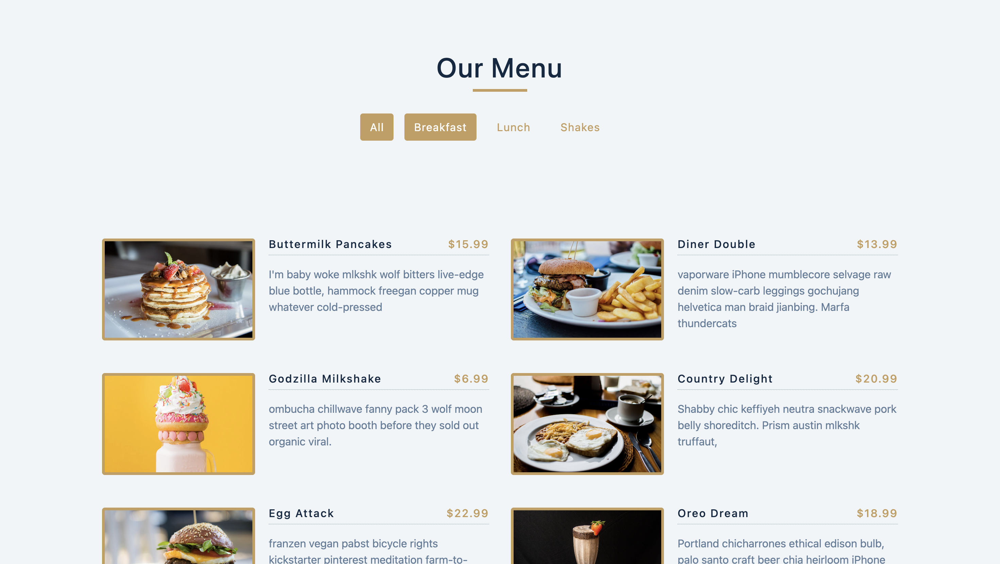

# React Menu Filter

A React project that displays a menu of food items and allows filtering by category. Users can click on category buttons to filter the displayed menu items dynamically.

---

## 🚀 Features
- Modern UI with React components  
- Clean and responsive design  
- Easy to customize and extend  

---

## 📂 Project Structure

```bash
my-awesome-project/
├── public/
│   └── index.html
├── src/
│   ├── components/
│   │   ├── Categories.js
│   │   └── Menu.js
│   ├── data.js
│   ├── App.js
│   ├── App.css
│   └── index.js
├── package.json
└── README.md
```
---

# ☕ Menu Resturant 

 

---

## 🛠️ Tech Stack
- **React**  
- **JavaScript (ES6+)**  
- **CSS**  

---

## ⚡ How to Use

1. **Install dependencies**
```bash
npm install
```
2.	**Start the development server**
``` bash
npm start
```
3.	**Open the app in your browser**
```bash
Go to http://localhost:3000
```
4.	**Filter menu items**
```bash
Click on any category button at the top to filter menu items by that category. The “All” button shows all items.
```
## Tech Stack

- React
- JavaScript
- CSS

## 📜 License  

This project is licensed under the **MIT License**.
